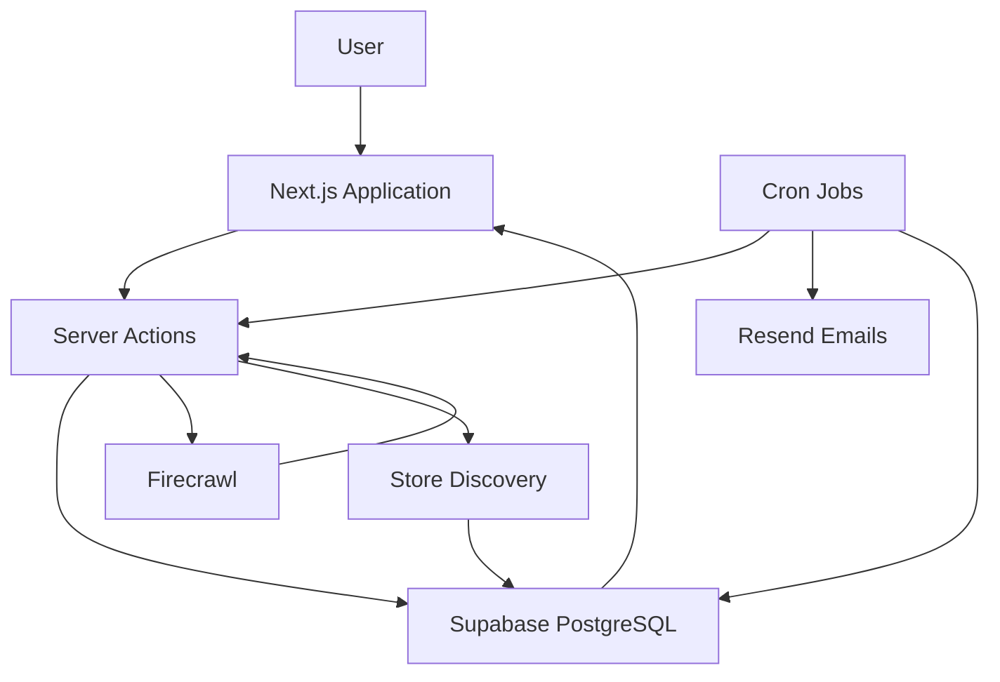

<div align="center">

# 🚀 NexPrice

### Smart Product Price Tracking & Deal Intelligence Platform

Track product prices across multiple online stores, receive instant price-drop alerts, analyze historical trends, and discover the best time to buy.

<p>
  <a href="https://getnexprice.vercel.app">🌐 Live Demo</a> •
  <a href="https://github.com/AbhishekAdiga05/NexPrice">💻 Source Code</a>
</p>


</div>

---

## 🎯 Overview

NexPrice is a full-stack web application that helps online shoppers monitor product prices, compare prices across multiple retailers, visualize price history, and receive automated notifications when products reach their desired price.

Instead of manually checking e-commerce websites every day, users can simply add a product URL and let NexPrice track prices automatically.

---

## ✨ Key Highlights

✅ Real-Time Product Price Tracking

✅ Multi-Store Price Comparison

✅ Historical Price Analytics

✅ Automated Price Drop Alerts

✅ Google OAuth Authentication

✅ Smart Deal Score Algorithm

✅ Buy Priority Ranking System

✅ Cron-Based Automated Monitoring

✅ Responsive Dashboard Experience

✅ Production-Ready Architecture

---

## 📸 Preview

### Landing Page


### Dashboard


### Product Analytics


### Store Comparison


---

## 💡 Why I Built NexPrice

Online shoppers frequently miss good deals because product prices change constantly across different retailers.

NexPrice was built to solve this problem by automatically tracking products, maintaining historical price records, monitoring discounts, and notifying users whenever a product becomes a worthwhile purchase.

The goal is simple:

> Stop guessing when to buy. Start buying at the right time.

---

## ✨ Core Features

| Feature | Description |
|----------|-------------|
| 📈 Price Tracking | Track product prices automatically from supported stores |
| 📊 Price History | View historical price changes through interactive charts |
| 🔔 Price Alerts | Receive notifications when products reach target prices |
| 📉 Price Drop Detection | Get informed whenever prices decrease |
| 🏪 Store Comparison | Compare prices across multiple retailers |
| 🎯 Deal Score Engine | Calculate deal quality using historical data |
| ⭐ Watchlist Management | Save products with custom priorities |
| 📊 Dashboard Analytics | Monitor savings, deals, and activity |
| 🔐 Google Authentication | Secure login using Google OAuth |
| 🛡 Row-Level Security | Users can only access their own data |
| 🌙 Dark & Light Mode | Fully responsive modern UI experience |

---

## 🛠 Tech Stack

| Layer | Technology |
|---------|------------|
| Frontend | Next.js 16, React 19, Tailwind CSS v4 |
| UI Components | shadcn/ui, Radix UI, Lucide React |
| Animations | Framer Motion |
| Charts | Recharts |
| Backend | Next.js Server Actions, Route Handlers |
| Database | Supabase PostgreSQL |
| Authentication | Supabase Auth + Google OAuth |
| Security | Row-Level Security (RLS) |
| Scraping | Firecrawl |
| Email Service | Resend |
| Notifications | Sonner |
| Deployment | Vercel |
| Linting | ESLint |

---

## 🏗️ System Architecture

The application follows a modern serverless architecture powered by Next.js, Supabase, Firecrawl, and Resend.



---

## ⚙️ How It Works

### 1. User Authentication

Users sign in securely using Google OAuth.

### 2. Product Tracking

Users paste a product URL.

The application:

- Validates the URL
- Extracts product information
- Saves product details
- Starts price monitoring

### 3. Price Monitoring

A scheduled cron job:

- Rechecks product prices
- Updates price history
- Detects price drops
- Triggers alerts
- Refreshes store comparisons

### 4. Insights Generation

The dashboard calculates:

- Best deals
- Potential savings
- Deal scores
- Buy priority rankings

---

## 🚀 Getting Started

### Prerequisites

- Node.js v18+
- npm
- Git
- Supabase Project
- Firecrawl API Key
- Resend API Key

### Installation

```bash
# Clone repository
git clone https://github.com/AbhishekAdiga05/NexPrice.git

# Navigate to project
cd NexPrice

# Install dependencies
npm install

# Create environment file
cp .env.example .env

# Configure environment variables

# Run database migration

# Start development server
npm run dev
```

Visit:

```txt
http://localhost:3000
```

---

## 🔑 Environment Variables

```env
# Supabase
NEXT_PUBLIC_SUPABASE_URL=
NEXT_PUBLIC_SUPABASE_ANON_KEY=
SUPABASE_SERVICE_ROLE_KEY=

# Firecrawl
FIRECRAWL_API_KEY=

# Resend
RESEND_API_KEY=
RESEND_FROM_EMAIL=

# Cron Security
CRON_SECRET=

# AI Predictions (Optional)
GEMINI_API_KEY=
GEMINI_MODEL=gemini-2.5-flash

# Application URL
NEXT_PUBLIC_APP_URL=
```

---

## 📂 Project Structure

```txt
NexPrice/
│
├── app/
├── components/
├── lib/
├── utils/
├── supabase/
│
├── Authentication
├── Product Tracking
├── Price Analytics
├── Store Comparison
├── Notifications
├── Dashboard Insights
└── Cron Automation
```

---

## 🔐 Authentication Flow

```text
User
  ↓
Google OAuth
  ↓
Supabase Auth
  ↓
Session Creation
  ↓
Dashboard Access
```

### Features

- Google Sign-In
- Session Persistence
- Secure Route Protection
- OAuth Redirect Validation

---

## 📡 API Endpoints

| Endpoint | Description |
|-----------|------------|
| GET / | Landing Page |
| GET /?tab=insights | Dashboard Insights |
| GET /?tab=watchlist | User Watchlist |
| GET /?tab=alerts | Price Alerts |
| GET /?tab=settings | User Settings |
| GET /products/[id] | Product Details |
| POST /api/cron/check-prices | Execute Price Monitoring |

### Protected Cron Endpoint

```http
POST /api/cron/check-prices

Authorization: Bearer YOUR_CRON_SECRET
```

### Cron Workflow

1. Fetch tracked products
2. Re-scrape prices
3. Update database
4. Save price history
5. Detect price drops
6. Trigger alerts
7. Send emails
8. Update store comparison data

---

## 📊 Database Design

### Main Tables

| Table | Purpose |
|---------|---------|
| products | Tracked products |
| price_history | Historical price records |
| price_alerts | User alerts |
| store_prices | Retailer comparison data |
| watchlist | Saved products |
| user_settings | User preferences |
| notifications | Alert history |
| price_predictions | Future AI prediction support |

### Security

- Row-Level Security Enabled
- User Data Isolation
- Secure OAuth Sessions
- Protected Cron Endpoints

---

## 📱 Mobile Experience

NexPrice is fully responsive and optimized for:

- Mobile Phones
- Tablets
- Laptops
- Desktop Devices

### Supported Interactions

- Responsive Navigation
- Adaptive Charts
- Touch-Friendly Forms
- Mobile Dialogs
- Dashboard Tabs

---

## 🛣️ Roadmap

### Completed

- [x] Product Tracking
- [x] Price History
- [x] Price Alerts
- [x] Google OAuth
- [x] Dashboard Analytics
- [x] Multi-Store Comparison
- [x] Email Notifications

### Planned

- [ ] AI Price Predictions
- [ ] Browser Extension
- [ ] Telegram Notifications
- [ ] WhatsApp Alerts
- [ ] Mobile Application
- [ ] Advanced Retailer Support

---

## 🧪 Manual Testing

```bash
# Start application
npm run dev

# Login with Google

# Add a product URL

# Create price alert

# Trigger cron endpoint

# Verify dashboard updates

# Check email notifications
```

---

## 📄 License

Distributed under the MIT License.

See the LICENSE file for additional information.

---

