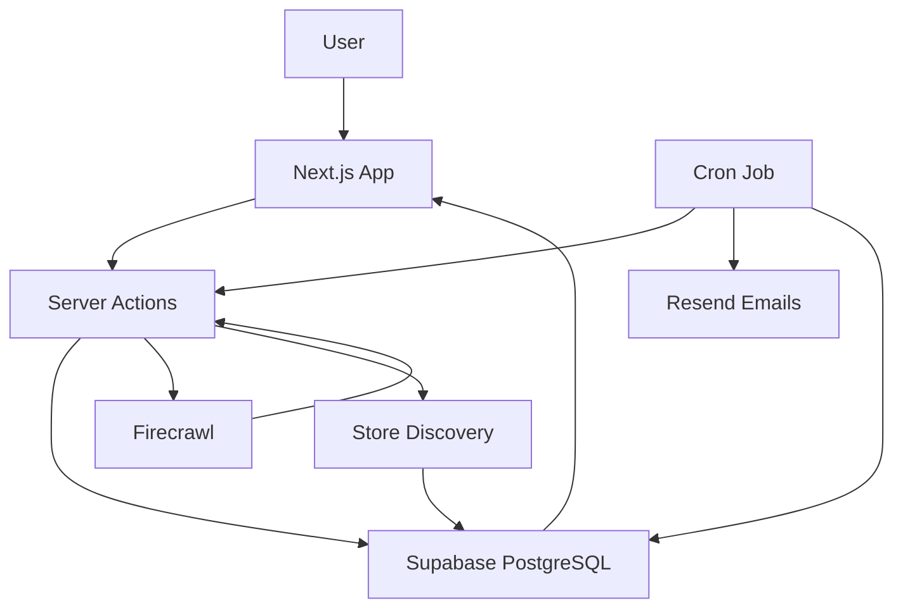

```md
<div align="center">

# NexPrice

**A smart product price tracker that helps shoppers monitor price drops, compare stores, and buy at the right time.**

[](https://getnexprice.vercel.app/)
[](https://github.com/AbhishekAdiga05/NexPrice)
[](LICENSE)


</div>

---

## 🧐 What is this?

NexPrice is a full-stack web app that helps online shoppers track product prices, view price history, compare prices across stores, and receive alerts when a target price is reached.

I built this because manually checking product prices on sites like Amazon and Flipkart is repetitive and easy to miss. It currently supports product tracking, price history, target alerts, deal scoring, watchlists, store comparison, and automated cron-based price checks. I’m working on improving scraping reliability, cron monitoring, search/filtering, and production-grade alert delivery.

> **Live:** [https://your-project.vercel.app](https://your-project.vercel.app)

---

## ✨ Features

- **Product Price Tracking** — Paste a product URL and the app extracts the product name, price, currency, and image using Firecrawl.
- **Price History Charts** — Stores price snapshots over time and displays them using Recharts.
- **Target Price Alerts** — Users can set a target price and receive email alerts when the price reaches that target.
- **Price Drop Emails** — Sends email notifications through Resend when a tracked product’s price drops.
- **Deal Score Algorithm** — Calculates a 0–100 score based on historical low, average price, recent trend, and volatility.
- **Buy Priority Score** — Ranks watchlisted products based on user priority, days on watchlist, and deal score.
- **Multi-Store Comparison** — Searches and compares prices across Amazon, Flipkart, Croma, Reliance Digital, and Tata CLiQ.
- **Watchlist** — Save products for later with High, Medium, or Low priority.
- **Dashboard Insights** — Shows tracked products, best deals, potential savings, alert counts, and recent activity.
- **Google OAuth Authentication** — Users sign in with Google through Supabase Auth.
- **Row-Level Security** — Supabase policies ensure users can only access their own data.
- **Dark / Light Theme** — Theme preference is saved in localStorage with flash-free initialization.

---

## 🛠 Tech Stack

| Layer | Technology |
|---|---|
| Frontend | Next.js 16 App Router, React 19, Tailwind CSS v4 |
| UI | shadcn/ui, Radix UI, Lucide React |
| Charts | Recharts |
| Animations | Framer Motion |
| Backend | Next.js Server Actions, Route Handlers |
| Database | Supabase PostgreSQL |
| Auth | Supabase Auth with Google OAuth |
| Security | Supabase Row-Level Security, cron bearer token, safe OAuth redirects |
| Scraping | Firecrawl |
| Email | Resend |
| Notifications | Sonner |
| Deployment | Vercel / Node-compatible hosting |
| Linting | ESLint + Next.js core web vitals config |

---

## 🧠 How It Works

1. User signs in with Google.
2. User pastes a product URL.
3. Next.js Server Action validates the URL.
4. Firecrawl extracts product name, price, currency, and image.
5. Product data is saved to Supabase under the signed-in user.
6. Price history is recorded for trend tracking.
7. Store discovery searches supported retailers and saves comparable store prices.
8. Users can set target alerts.
9. A cron job re-checks product prices, updates history, checks alerts, sends emails, and logs notifications.



---

## 🚀 Getting Started

### Prerequisites

Make sure you have the following installed:

- [Node.js](https://nodejs.org/) v18+
- [npm](https://www.npmjs.com/)
- [Git](https://git-scm.com/)
- A [Supabase](https://supabase.com/) project
- A [Firecrawl](https://www.firecrawl.dev/) API key
- A [Resend](https://resend.com/) API key

---

### Installation

```bash
# 1. Clone the repo
git clone https://github.com/yourusername/smart-product-price-tracker.git

# 2. Move into the project folder
cd smart-product-price-tracker

# 3. Install dependencies
npm install

# 4. Copy environment example
cp .env.example .env

# 5. Fill in your environment variables in .env

# 6. Run Supabase migration
# Open Supabase Dashboard → SQL Editor → paste supabase/migration.sql → Run

# 7. Start the dev server
npm run dev
```

Open [http://localhost:3000](http://localhost:3000) in your browser.

---

## ⚙️ Environment Variables

Create a `.env` file in the root directory.

```env
# === Required: Supabase ===
NEXT_PUBLIC_SUPABASE_URL=https://your-project.supabase.co
NEXT_PUBLIC_SUPABASE_ANON_KEY=your-anon-key
SUPABASE_SERVICE_ROLE_KEY=your-service-role-key

# === Required: Web Scraping ===
FIRECRAWL_API_KEY=fc-your-firecrawl-key

# === Required: Email Notifications ===
RESEND_API_KEY=re_your-resend-key
RESEND_FROM_EMAIL=onboarding@resend.dev

# === Required: Cron Job Security ===
CRON_SECRET=your-random-secret

# === Optional: AI Price Predictions ===
GEMINI_API_KEY=your-gemini-key
GEMINI_MODEL=gemini-2.5-flash

# === Required: App URL ===
NEXT_PUBLIC_APP_URL=http://localhost:3000
```

> Never commit real `.env` values. Only placeholder values should exist in `.env.example`.

---

## 📂 Project Structure

```txt
smart-product-price-tracker/
├── app/
│   ├── actions.js                         # Server Actions
│   ├── api/
│   │   └── cron/check-prices/route.js     # Cron endpoint
│   ├── auth/callback/route.js             # Google OAuth callback
│   ├── dashboard/
│   │   └── product/[productId]/           # Product detail dashboard route
│   ├── products/[id]/                     # Product detail route
│   ├── layout.js                          # Root layout
│   ├── page.js                            # Landing page / dashboard
│   ├── loading.js                         # Global loading UI
│   ├── error.js                           # Error boundary
│   └── not-found.js                       # 404 page
├── components/
│   ├── ui/                                # shadcn/ui primitives
│   ├── AddProductForm.js
│   ├── AlertsDashboard.js
│   ├── AuthButton.js
│   ├── AuthModal.js
│   ├── DashboardAnalyticsChart.js
│   ├── DashboardShell.js
│   ├── DealScoreBadge.js
│   ├── InsightsDashboard.js
│   ├── NavBar.js
│   ├── PriceChart.js
│   ├── ProductCard.js
│   ├── SetPriceAlert.js
│   ├── StoreComparison.js
│   ├── WatchlistDashboard.js
│   └── SettingsForm.js
├── lib/
│   ├── buy-priority.js                    # Buy Priority scoring
│   ├── deal-score.js                      # Deal Score algorithm
│   ├── email.js                           # Resend email templates
│   ├── firecrawl.js                       # Firecrawl wrapper
│   ├── product-matcher.js                 # Product text matching
│   ├── retailers.js                       # Supported retailers
│   ├── store-discovery.js                 # Store comparison logic
│   └── store-utils.js                     # Store price helpers
├── utils/supabase/
│   ├── client.js
│   ├── server.js
│   └── middleware.js
├── supabase/
│   └── migration.sql
├── middleware.js
├── next.config.mjs
├── package.json
├── .env.example
└── README.md
```

---

## 📸 Screenshots

| Landing Page | Dashboard |
|---|---|
|  |  |

| Product Detail | Store Comparison |
|---|---|
|  |  |

---

## 🔐 Authentication

NexPrice uses Supabase Auth with Google OAuth.

Authentication flow:

1. User clicks **Sign In**.
2. Google OAuth redirects to `/auth/callback`.
3. The app exchanges the authorization code for a session.
4. The user is redirected back to the dashboard.
5. Middleware refreshes the Supabase session on requests.

There is currently no email/password login or forgot-password flow.

---

## 📡 API Endpoints

### `GET /`

Returns the landing page for anonymous users or the dashboard for authenticated users.

### `GET /?tab=insights`

Shows insights such as total savings, active alerts, best deals, and recent savings.

### `GET /?tab=watchlist`

Shows saved watchlist items sorted by Buy Priority Score.

### `GET /?tab=alerts`

Shows active, triggered, and disabled price alerts.

### `GET /?tab=settings`

Shows account details and notification preferences.

### `GET /products/[id]`

Shows product details, price history, deal score, alerts, and store comparison.

### `GET /dashboard/product/[productId]`

Alternative dashboard product detail route.

### `GET /api/cron/check-prices`

Returns a status message confirming the cron endpoint is available.

### `POST /api/cron/check-prices`

Runs the price check workflow.

Requires:

```http
Authorization: Bearer YOUR_CRON_SECRET
```

The cron job:

1. Fetches all tracked products.
2. Re-scrapes each product URL.
3. Updates current price.
4. Adds price history when price changes.
5. Sends price drop emails.
6. Checks target alerts.
7. Sends target reached emails.
8. Logs notification attempts.
9. Refreshes store comparison prices.

Run manually:

```powershell
Invoke-RestMethod -Uri "http://localhost:3000/api/cron/check-prices" `
  -Method Post `
  -Headers @{ Authorization = "Bearer YOUR_CRON_SECRET" }
```

> For real alert delivery, this endpoint must be scheduled by an external cron provider or deployment platform.

---

## 🧪 Manual Test Flow

```bash
# 1. Start the app
npm run dev

# 2. Open the app
http://localhost:3000

# 3. Sign in with Google

# 4. Add a product URL

# 5. Set a target price alert

# 6. Run the cron job manually

# 7. Check dashboard, alerts, email, and notifications table
```


## 📊 Database Design

Main tables:

| Table | Purpose |
|---|---|
| `products` | Stores tracked products per user |
| `price_history` | Stores time-series price snapshots |
| `price_alerts` | Stores target price alerts |
| `store_prices` | Stores prices from different retailers |
| `watchlist` | Stores saved products and user priority |
| `user_settings` | Stores notification preferences |
| `notifications` | Stores email/notification attempt history |
| `price_predictions` | Reserved for future prediction feature |

Important constraints:

- `products`: unique `user_id + url`
- `store_prices`: unique `product_id + store_name`
- `watchlist`: unique `user_id + product_id`
- `price_alerts`: target price must be greater than 0
- Row-Level Security is enabled across tables

---

## 📱 Mobile Support

NexPrice is responsive and supports mobile layouts.

Supported mobile interactions:

- Mobile sidebar navigation
- Responsive product cards
- Responsive charts
- Touch-friendly forms
- Mobile dialog modals
- Responsive dashboard tabs

Known mobile limitations:

- Some badges and labels use small text.
- Icon-only delete buttons may be small on very small screens.
- Store comparison tables may require horizontal reading on narrow screens.

---

## 📄 License

Distributed under the MIT License. See [LICENSE](LICENSE) for details.

---


<div align="center">
If this project helped you or you found it interesting, consider giving it a ⭐
</div>
```