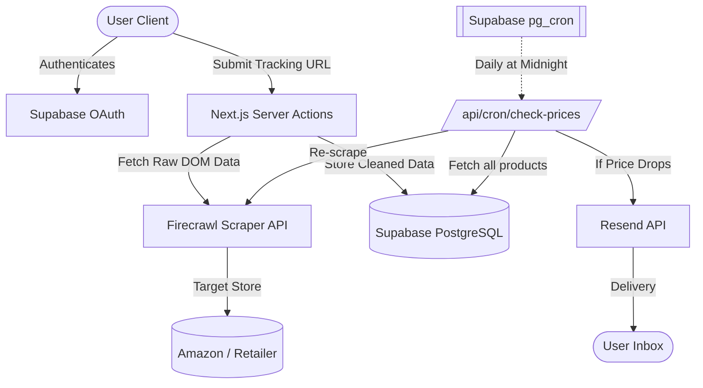
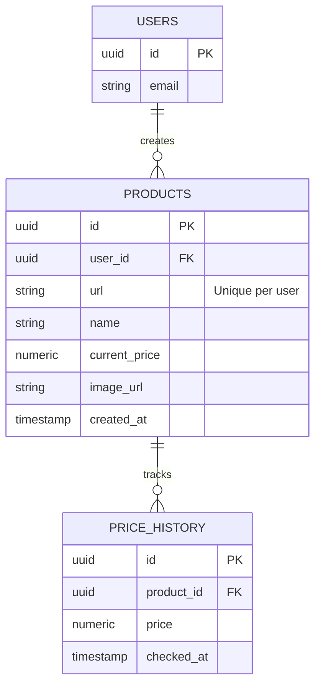

<div align="center">
  
  # 🎯 NexPrice

  **Intelligent, Automated E-Commerce Price Tracking Infrastructure**

  <p align="center">
    A meticulously crafted full-stack Next.js application that autonomously monitors e-commerce products, visualizes price history data, and dispatches real-time automated email alerts. 
    <br />
    Designed with a premium "Modern Soft UI" aesthetic and resilient backend systems.
  </p>

  <div>
    
    
    
    
    
  </div>
</div>

<br />

---

## 📑 Table of Contents
- [About The Project](#-about-the-project)
- [Key Features](#-key-features)
- [System Architecture](#-system-architecture)
- [Database ER Diagram](#-database-er-diagram)
- [Getting Started (Local Dev)](#-getting-started-local-dev)
- [Automation & Cron Jobs](#-automation--cron-jobs)
- [Deployment Guide](#-deployment-guide)

---

## 🌟 About The Project

NexPrice tackles a common consumer problem: constantly checking product pages waiting for a price drop. By simply pasting a URL from major e-commerce platforms (Amazon, Walmart, BestBuy), this application parses the complex DOM structures, extracts price mathematics, saves data points into a historical PostgreSQL chart, and executes background CRON jobs without any further user intervention. 

### Why This Tech Stack?
- **Next.js (App Router)**: Utilizing React Server Components (RSC) to directly query the database from the server, entirely skipping unnecessary client-side data fetching spinners.
- **Supabase**: Chosen for its robust PostgreSQL core, allowing execution of strict Row Level Security (RLS) policies and direct database triggering (`pg_cron`) to hit serverless Next.js API endpoints.
- **Firecrawl**: A powerful LLM-driven scraping layer capable of rendering dynamic JavaScript-heavy stores and accurately resolving varied pricing structures into clean JSON.
- **Resend**: Chosen for lightning-fast transactional email deliverability and native React-Email template support.

---

## ✨ Key Features

### 🛡️ Secure & Private Tracking
- **Google OAuth**: Fast, secure user onboarding managed by Supabase Auth sessions.
- **Row Level Security (RLS)**: PostgreSQL restrictions ensure users can strictly only view, update, and delete their own tracking queries.

### 🧠 Intelligent Web Scraping
- **URL Agnostic**: Paste an unstructured link, and the system intelligently extracts Name, Current Price, Currency, and High-Resolution Images.
- **Bot Bypass**: Firecrawl handles proxy rotations and browser fingerprinting seamlessly.

### 📉 Data Visualization
- **Interactive Graphs**: Historic price data points are instantly plotted onto responsive `recharts` line graphs.
- **Daily State Sync**: Active products run a differential analysis against yesterday's price to determine if a sale is active.

### 🛎️ Automated Alerts
- **Zero-Touch Execution**: A daily CRON job loops over all actively tracked products and re-scrapes the source URL.
- **Transactional Delivery**: If `new_price < old_price`, an optimized HTML/React email is fired to the registered user.

---

## 🏛️ System Architecture



---

## 🗄️ Database ER Diagram

The backend relies on two tightly coupled relational tables.



---

## 🚀 Getting Started (Local Dev)

Follow these instructions to boot the application securely on your local machine.

### 1. Prerequisites
- Node.js 18+
- Supabase Account
- Firecrawl API Key
- Resend API Key

### 2. Installation
```bash
git clone https://github.com/ABHISHEK-ADIGA/smart-product-price-tracker.git
cd smart-product-price-tracker
npm install
```

### 3. Environment Variables
Duplicate `.env.example` into `.env.local` or define the following:
```env
# SUPABASE CONFIGURATION
NEXT_PUBLIC_SUPABASE_URL=your_project_url
NEXT_PUBLIC_SUPABASE_ANON_KEY=your_anon_key

# SUPABASE OAUTH / LOCAL DEV
NEXT_PUBLIC_APP_URL=http://localhost:3000

# WEB SCRAPING INTELLIGENCE
FIRECRAWL_API_KEY=your_firecrawl_api_key

# TRANSACTIONAL EMAIL PROVIDER
RESEND_API_KEY=your_resend_api_key
RESEND_FROM_EMAIL=alerts@yourdomain.com
```

### 4. Database Initialization
Run the following SQL inside your Supabase SQL Editor to build the schemas and secure them:

```sql
CREATE EXTENSION IF NOT EXISTS "uuid-ossp";

CREATE TABLE products (
  id UUID DEFAULT uuid_generate_v4() PRIMARY KEY,
  user_id UUID REFERENCES auth.users(id) ON DELETE CASCADE,
  url TEXT NOT NULL,
  name TEXT NOT NULL,
  image_url TEXT,
  currency TEXT DEFAULT '$',
  current_price NUMERIC NOT NULL,
  created_at TIMESTAMPTZ DEFAULT NOW(),
  updated_at TIMESTAMPTZ DEFAULT NOW(),
  UNIQUE(user_id, url)
);

CREATE TABLE price_history (
  id UUID DEFAULT uuid_generate_v4() PRIMARY KEY,
  product_id UUID REFERENCES products(id) ON DELETE CASCADE,
  price NUMERIC NOT NULL,
  checked_at TIMESTAMPTZ DEFAULT NOW()
);

-- Secure the Database to prevent unauthorized access
ALTER TABLE products ENABLE ROW LEVEL SECURITY;
ALTER TABLE price_history ENABLE ROW LEVEL SECURITY;

CREATE POLICY "Users can only select their own data" ON products FOR SELECT USING (auth.uid() = user_id);
CREATE POLICY "Users can only insert their own data" ON products FOR INSERT WITH CHECK (auth.uid() = user_id);
CREATE POLICY "Users can only delete their own data" ON products FOR DELETE USING (auth.uid() = user_id);
```

### 5. Launch the App
```bash
npm run dev
```

---

## ⚙️ Automation & Cron Jobs

NexPrice relies on `pg_cron` inside PostgreSQL to run a scheduled background job, meaning you do not have to pay for an external scheduler service (like Vercel Cron). 

Execute this in Supabase to start the midnight price-checking loop:
```sql
CREATE EXTENSION IF NOT EXISTS pg_cron;

SELECT cron.schedule(
  'daily-price-scraper',
  '0 0 * * *', -- Runs exactly at midnight UTC
  $$
    SELECT net.http_post(
        url:='https://YOUR_PRODUCTION_DOMAIN/api/cron/check-prices',
        headers:='{"Content-Type": "application/json"}'::jsonb
    )
  $$
);
```
*(⚠️ Ensure you change `YOUR_PRODUCTION_DOMAIN` to your live Vercel URL, or `ngrok` URL during local testing).*

---

## 🌐 Deployment Guide

This app is tailor-made for seamless deployment on **Vercel**.
1. Push your stable `main` branch to GitHub.
2. Initialize a new project in Vercel and import the repository.
3. Add all your keys from `.env.local` to the Vercel **Environment Variables** dashboard.
4. Finalize the deployment.
5. **Critical Auth Step**: Log into Supabase > Authentication > URL Configuration. Update your Site URL and Redirect URIs to match your new `https://project.vercel.app` string. Do the same inside Google Cloud Console if using Google OAuth.

---

<p align="center">
  <i>Developed and designed by Abhishek Adiga to redefine automated e-commerce tooling.</i>
</p>
